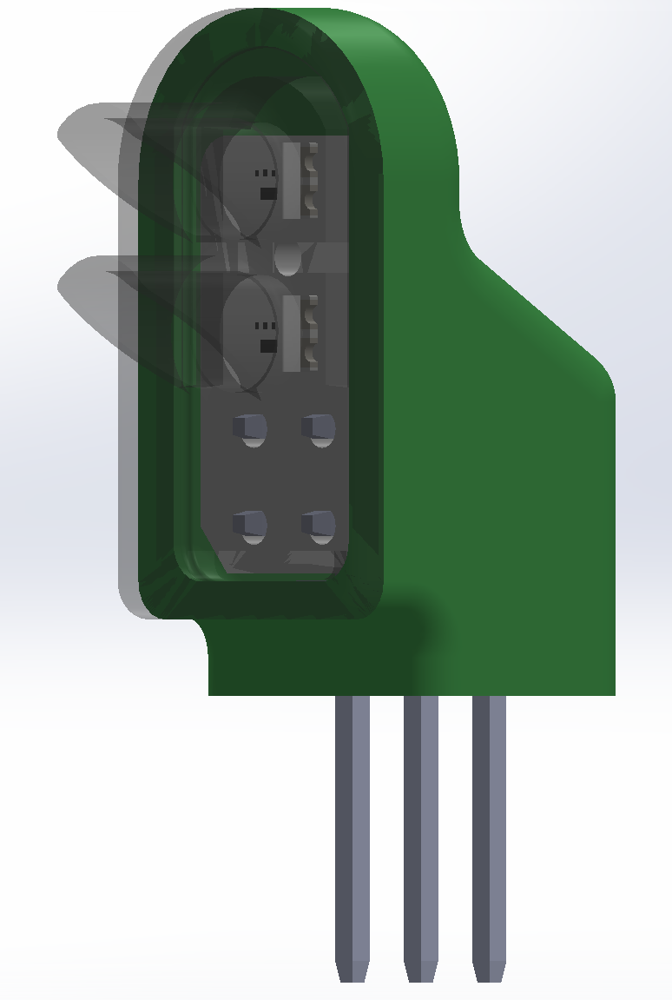
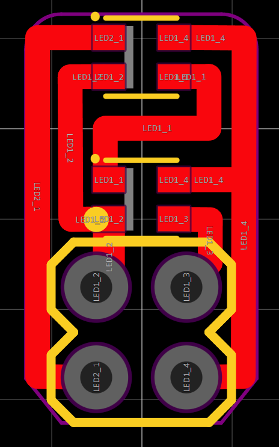
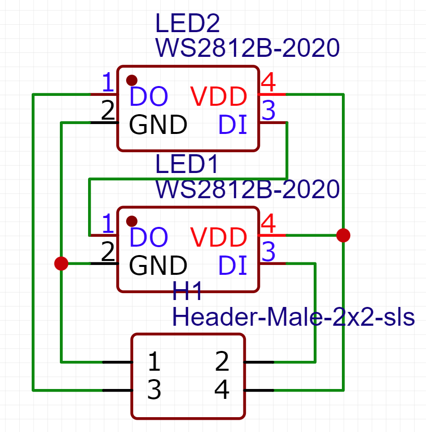
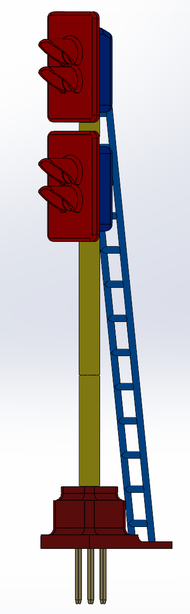
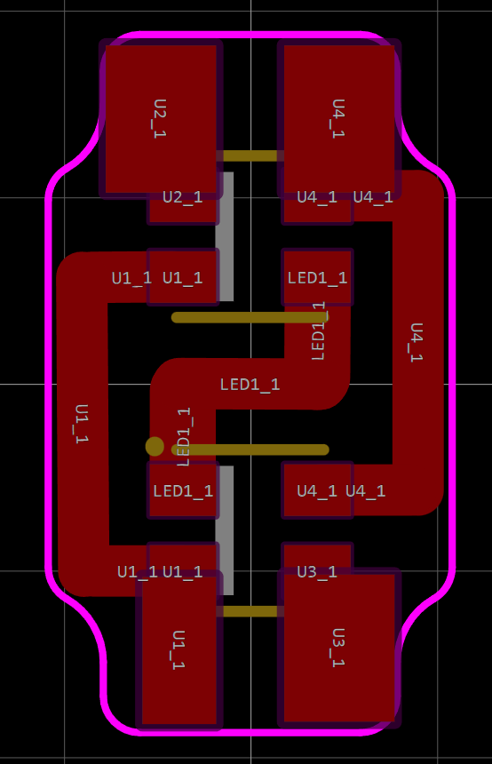
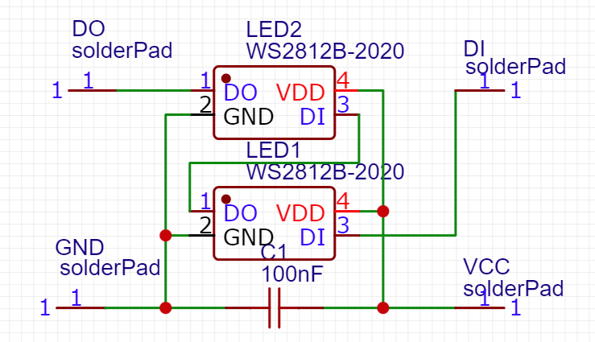

<!-- PROJECT LOGO -->
 

  

<h3 align="center">RGB train traffic lights for HO scale (1:87) train railroad model</h3>

  

    Project created as a part of Rigas Technical University VIP program years 2021 till 2023. Lights based on the WS2812B rgb LEDs in 2020 body. Body printed in black resin using Anycubic Mono, PCBs designed using EasyEDA and cut on a CNC mill, manual assembly required. Light control using an Arduino over Serial communication.  
  

<!-- ABOUT THE PROJECT -->
## About The Project

Project created as a part of the VIP team Robotics.

  
   
  

  
   
  

