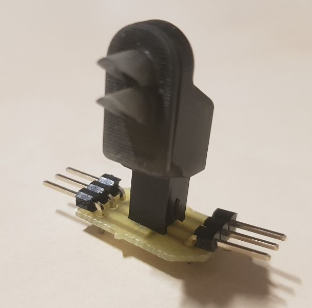

<!-- PROJECT LOGO -->
 

  

<h3 align="center">RGB train traffic lights for HO scale (1:87) train railroad model</h3>

  

    Project created as a part of Rigas Technical University VIP program years 2021 till 2023. Lights based on the WS2812B rgb LEDs in 2020 body. Body printed in black resin using Anycubic Mono, PCBs designed using EasyEDA and cut on a CNC mill, manual assembly required. Light control using an Arduino over Serial communication.  
  

<!-- ABOUT THE PROJECT -->
## About The Project

Project created as a part of the VIP team Robotics.

Part list: 
- WS2812B LEDs,
- 2.54mm 2x2 90 degrees angled headers for the floor lights and straight headers for the tower lights,
- 2.54mm 2x2 female sockets for the floor mounting,
- 2.54mm 1x3 male pins for the floor board connections.
- 

  
   
  

  
   
  

